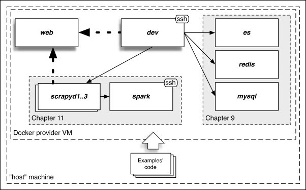
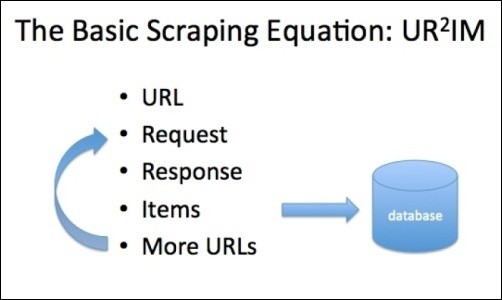
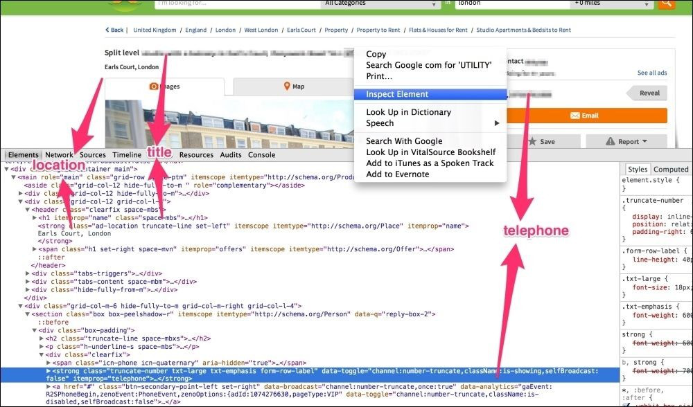
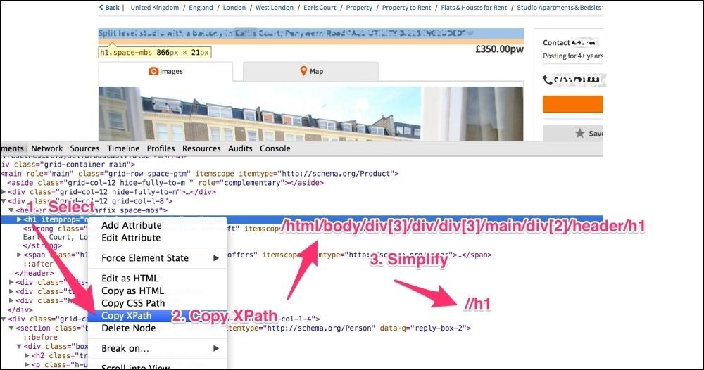

# 爬虫基础

这是一个非常重要的章节，你可能会读几遍，并经常返回寻找解决方案。我们将首先解释如何安装Scrapy，然后继续随着众多实例和不同的实现方法开发scrapy爬虫。在开始之前，让我们先来看看一些重要的概念。

我们将互换地使用术语 'terminal(终端)'，'console(控制台)'，'command line(命令行)'，他们在本书中没有区别。

## 安装scrapy 
**具体的各操作系统的安装略，自行google或百度**
* Vagrant安装：本书运行示例的官方方法
 

你的电脑在Vagrant被称为主机（host），Vagrant 使用我们的主机运行一个虚拟机。这些技术使得我们有一个带私有网络的独立的环境，在运行示例时不受你主机软硬件的影响。

大多数章节只使用两个服务—"dev"和"web"。我们登录到"dev"运行scrapy 爬虫从"web"抓取页面。后面的章节使用更多的服务，包括数据库和大数据处理引擎。

按照附录A的指导在你的操作系统上安装 Vagrant。你可以这样做得到这本书的代码：
```
$ git clone https://github.com/scalingexcellence/scrapybook.git
$ cd scrapybook
```
你也可以用下面的命令开启 Vagrant ：
`$ vagrant up --no-parallel`
第一次运行可能会花一些时间，Vagrant开启后，登录虚拟的 dev 设备：
`$ vagrant ssh`
现在你在dev的控制台。代码已从主机复制到开发机器，您可以在"book" 文件夹中找到它：
```
$ cd book
$ ls
ch03 ch04 ch05 ch07 ch08 ch09 ch10 ch11…
```
打开几个控制台，用`vagrant ssh`打开多个开发终端。你可以使用 `vagrant halt` 关闭系统和 `vagrant status` 检查他们的状态。注意，`vagrant halt` 不会关闭虚拟机。如果这有问题，可以手动停止它，或者用`vagrant global-status`查找它的 id （名字为"docker-provider"），然后用`vagrant halt <ID>`关闭它。利用vagrant，离线状态下大多数的例子也都可以运行。

现在我们完成了系统的安装，准备开始学习scrapy。

## 基本的爬取过程


* **URL**
一切开始于一个URL，你需要一些目标网站的URL。这将用 [Gumtree](https://www.gumtree.com/) 分类网站做示例演示。

例如，通过访问 http://www.gumtree.com/flats-houses/london 上 Gumtree 的伦敦房产页面，你将能够发现大量的房产URL。你可以复制他们通过在分类列表右击，然后点击 **Copy Link Address** 。这些URL看起来可能像 https://www.gumtree.com/p/studios-bedsits-rent/split-level 。这是没问题的对于真实网站的几个URL。但在Gumtree 网站改变之后，XPath表达式可能停止工作。另外，如果你不是用 user-agent，Gumtree将不会回复。你可以使用 scrapy shell 加载一个页面：
```
scrapy shell -s USER_AGENT="Mozilla/5.0" <your url here	e.g. http://www.gumtree.com/p/studios-bedsits-rent/...>
```
为了调试使用 scrapy shell 的问题，添加 `--pdb` 参数在异常情况下启用交互式调试。
`scrapy shell --pdb https://gumtree.com`

**Tip：**
scrapy shell 是开发 scrapy 非常重要的工具。

显然，我们不鼓励你在学习本书时攻击 Guntree 的网站，而且我们不希望本书的例子在任何时候崩溃。 即使你不联网，我们也希望你能够开发并运行我们的例子。这就是为什么 Vagrant 开发环境包含一个提供了生成类似Gumtree页面的web服务器。他们可能看起来不像真正的网站好，但从爬虫的角度来看，他们是完全一样的。在你的 Vagrant 开发设备上，你可以在 *http://web:9312/* 点击web服务器，在浏览器打开 *http://localhost:9312/* 。

我们来用scrapy shell 从服务器打开一个页面。
```
$ scrapy shell http://web:9312/properties/property_000000.html
...
[s] Available Scrapy objects:
[s]	crawler	<scrapy.crawler.Crawler object at 0x2d4fb10> [s]	item	{}
[s]	request	<GET http:// web:9312/.../property_000000.html> [s]	response	<200 http://web:9312/.../property_000000.html> [s]	settings	<scrapy.settings.Settings object at 0x2d4fa90> [s]	spider	<DefaultSpider 'default' at 0x3ea0bd0>
[s] Useful shortcuts:

[s]	shelp()	Shell help (print this help)
[s]	fetch(req_or_url) Fetch request (or URL) and update local… [s]	view(response)	View response in a browser
>>>
```
我们得到了一些输出，现在你在一个（Python）环境中，你可以用来测试你刚刚加载的页面（你可以随时退出用Ctrl + D）。

* **request and response**  (请求和响应)
* 在先前的日志部分，你可能注意到了*scrapy shell*会自动为我们做一些事情。我们给它一个URL，它会执行一个默认的GET请求并得到成功响应（状态码-200）。这意味着来自该页的信息已经加载并准备使用。如果我们试图打印response.body的前50个字符，我们得到如下：
```
>>> response.body[:50]
'<!DOCTYPE html>\n<html>\n<head>\n<meta charset="UTF-8"'
```

**Tip**
这是给定的 Gumtree 页面上的HTML内容。请求和回应部分并没有给我们带来太多的麻烦。然而，有许多情况下，你将需要做一些工作，使得它们好用。我们将在第5章看到一些。

* **Items**（xpath内容提取的方法）
下一步是去尝试从 response 中抽取数据到 Item 的 fields 中。因为页面格式是HTML，我们使用XPath表达式。首先来看一下页面：


从上图可知，有大量的信息在这里，但其中大部分是布局文件：标志，搜索框，按钮等等。这是不错的，但对于爬虫来说并不有趣。我们可能感兴趣的领域是，例如，列表的标题，位置，或代理的电话号码。它们都有一个相应的HTML元素，我们需要找到它，并用我们之前提到的方法提取数据。让我们从标题开始。



右击页面上的标题，选择检查元素。这就把我们带到了相关的HTML代码。现在，右击并选择复制XPath来提取此标题的XPath表达式。你会注意到，Chrome给我们一个XPath表达式是准确的，但它是非常复杂且脆弱的。我们将其简化一点。我们只使用它的最后一部分，并用表达式 `//h1` 选择H1元素。这是欺骗的方法，因为我们不想要页面中的每一个*h1*，只是一个被用作标题。但是大多数网站的每个页面只有一个*h1*。

**Tip**
SEO是搜索引擎优化的缩写：优化网站的编码、内容、入站和出站链接的过程，以尽可能促进搜索引擎。

用 scrapy shell 检查一下这个Xpath表达式是否工作：
```
>>> response.xpath('//h1/text()').extract() 
[u'set unique family well']
```
很好，它工作正常。你可能注意到了我在*h1* 表达式后面加了*/text()* 。这是为了提取 *h1*的文本内容，而不是 *h1* 元素本身。我们总是用*/text()*提取文本字段。如果我们跳过它，我们会得到整个元素的文本（包括标记）：
```
>>> response.xpath('//h1').extract()
[u'<h1 itemprop="name" class="space-mbs">set unique family well</h1>']
```

...略...

**Tip**

**Note**


## 一个scrapy 工程
到目前为止，我们都是在 scrapy shell 中写代码。用 *Ctrl+D*退出scrapy shell，你之前写的代码会丢失。我们不想每次爬取时都写代码，所以我们使用scrapy工程。 我们创建一个名为"properties"的工程。
```
$ scrapy startproject properties
$ cd properties
$ tree
.
├── properties
│	├── 	init 	.py
│	├── items.py
│	├── pipelines.py
│	├── settings.py
│	└── spiders
│	└── 	init 	.py
└── scrapy.cfg

2 directories, 6 files
```
**Tip**
也可以从GitHub上获取代码`git clone https://github.com/scalingexcellence/scrapybook` 。这部分代码在*ch03/properties*目录下。

我们可以看到这个scrapy工程的目录结构。`scrapy startproject properties`命令创建了一个工程目录，并生成三个有趣的文件：*item.py*，*pipelines.py*，*settings.py*。还有一个名为*spiders*的子目录，目前是空的。在这章，我们将大量使用*items.py* 和*spiders*目录下的文件。之后的章节我们将探索更多的设置，pipelines 和*scrapy.cfg* 文件。


* 定义items


* 写爬虫


* 设置pipelines


* 保存到文件


