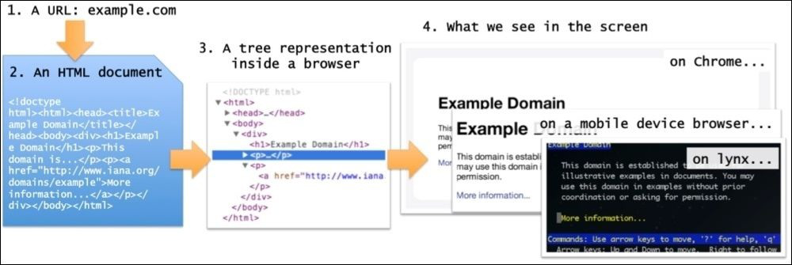
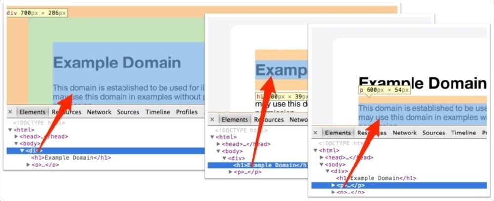
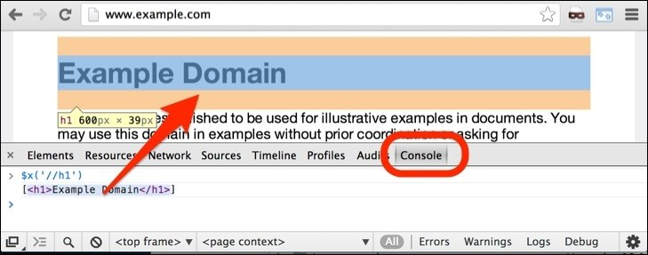

# 理解HTML和XPath

首先了解一下从用户在浏览器中点击一个按钮或输入一个链接到一个页面显示在屏幕上的工程中发生了什么。对于这本书来说，这个过程有四步：

* 一个URL被键入浏览器。这个url的头部（比如 baidu.com）被用来在网络中寻找匹配的服务器，同时这个url的其他数据，像来自 request 的 cookies 被发送给服务器。
* 服务器通过给浏览器发送一个HTML页面来回应。*注意*：这个服务器也可能返回其他格式的数据，比如 XML 或者 JSON ，但是我们在这只讨论HTML。
* 这个HTML文件在浏览器内被转换成一个树形结构：DOM（Document Object Model）。
* 根据一些布局规则，这个树形结构被呈现为你在屏幕上看到的样子。

让我们看看这些步骤和这些文档的表示。这将有助于你定位那些想要抓取的内容，并写程序获取它们。

## URL
对于我们来说，这个URL有两个主要部分。第一部分帮助我们定位匹配的服务器通过DNS。比如，当你发送 https://mail.google.com/mail/u/0/#inbox 到浏览器，它创建了一个 mail.google.com上的DNS 请求，它返回相应服务器的IP地址，比如 173.194.71.83。 然后，https://mail.google.com/mail/u/0/#inbox 转换成 https://173.194.71.83/mail/u/0/#inbox 。

这个URL的剩余部分对于服务器理解这个request请求的是什么是非常重要的。它可能是服务器上的一个图片，一个文档，或者其他一些需要触发一个操作的请求（比如发送一个邮件）。

## HTML文档
服务器读取URL，理解我们请求的是什么，用一个HTML文档作为回应。这个文档本质上是一个我们可以用记事本、Notepad、vi 等打开的文本文档。不像大多数的文本文档，HTML文档有一个特定的格式。

...略...知道什么是HTML文档就行，深入的可以去[w3school](http://www.w3school.com.cn/) 或[菜鸟教程](http://www.runoob.com/)学习。

## 树形表示
每个浏览器都有自己复杂的内在数据结构，来帮助网页的显示。DOM表示是跨平台、与语言无关的，并且大多数浏览器支持它。

为了看见网页在 Chrome 中的树形表示，在你感兴趣的元素上点击右键，选择审查元素（有些版本是检查）。如果这个功能不能使用，你可以在Chrome菜单->工具（更多工具）->点击开发者工具找到它。（快捷键：在页面中按 F12）

此时，会看到一些很像HTML的东西，但实际上他们并不相同。它是HTML代码的树形表示。不管HTML文档如何使用空格和换行符，它看起来都一样。你可以点击每一个元素来检查或操纵属性，并且在屏幕上实时看到的这些改变发生了什么影响。例如，如果你双击某些文本，改变它，回车，这个文本在屏幕上将被更新。在右边，属性(Properties)标签下，你可以看到这棵树的标签，在底部你可以看到一个面包屑状结构，显示当前选定的元素在HTML层次结构中的精确位置。

需要记住的重要点是，虽然HTML只是文本，但这个树形表示是你通过开发者工具可以看到和操作的**浏览器对象**。

## 你在屏幕上看到的
HTML文本和树形表示都没有一点像你在屏幕上看到的那么漂亮。这是HTML如此成功的原因之一。
它是一种被人类阅读的文档，并且指定了页面的内容，但这不是它将呈现在网页上的方式。这意味着浏览器的职责是渲染HTML文档并使其看起来好看，无论它是一个功能齐全的浏览器（如Chrome），还是一个移动设备浏览器，或者甚至是一个文本浏览器（如Lynx）。

也就是说，网络的发展促使网络开发者和用户对网页呈现的方式有了更多的控制。CSS的创建是为了提示HTML元素是如何呈现的。虽然对于爬虫，我们不需要任何与CSS有关的东西。

那么，树结构如何映射到屏幕上使我们看到？答案在于所谓的盒子模型。正如DOM树元素可以包含其他元素或文本一样，默认情况下，当呈现在屏幕上时，一个元素的框*包含*嵌入元素的框。从这个意义上说，我们在屏幕上看到的是HTML文档的二维表示形式——但是树结构是表示的一部分，以隐藏的方式。例如，在下面的图片中，我们看到三个 DOM 元素——一个 &lt;DIV&gt; 和两个嵌入式元素，一个 &lt;h1&gt; 和一个 &lt;p&gt; 出现在浏览器和 DOM：

# 用XPath选择HTML元素
为了在Chrome中使用XPath，点击开发者工具的**console** 标签，使用 $x 功能。举个栗子，你可以尝试 `$x('//h1')` 在 http://example.com 。它将移动浏览器到这个&lt;h1&gt;元素，如下图所示：

你在Console标签下看到返回的是包含所选元素的JS数组。如果你把鼠标放上去，被选择的元素在屏幕中会被高亮。这是非常方便的。

## 有用的XPath表达式
