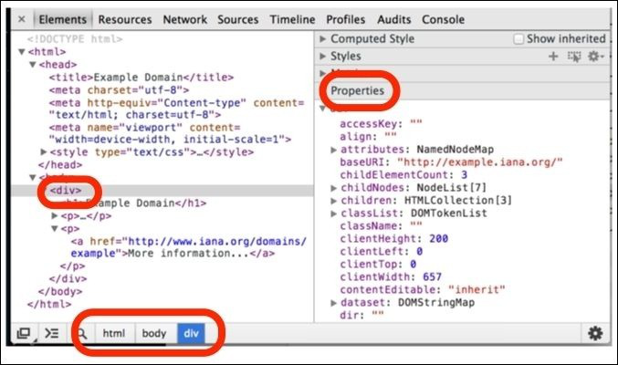

# 理解HTML和XPath
相关推荐：
* w3shcool 的 HTML 和 xpath 教程
* 菜鸟教程的 HTML 和 xpath 教程


首先了解一下从用户在浏览器中点击一个按钮或输入一个链接到一个页面显示在屏幕上的工程中发生了什么。对于这本书来说，这个过程有四步：

* 一个URL被键入浏览器。这个url的头部（比如 baidu.com）被用来在网络中寻找匹配的服务器，同时这个url的其他数据，像来自 request 的 cookies 被发送给服务器。
* 服务器通过给浏览器发送一个HTML页面来回应。*注意*：这个服务器也可能返回其他格式的数据，比如 XML 或者 JSON ，但是我们在这只讨论HTML。
* 这个HTML文件在浏览器内被转换成一个树形结构：DOM（Document Object Model）。
* 根据一些布局规则，这个树形结构被呈现为你在屏幕上看到的样子。


让我们看看这些步骤和这些文档的表示。这将有助于你定位那些想要抓取的内容，并写程序获取它们。

## URL
对于我们来说，这个URL有两个主要部分。第一部分帮助我们定位匹配的服务器通过DNS。比如，当你发送 https://mail.google.com/mail/u/0/#inbox 到浏览器，它创建了一个 mail.google.com上的DNS 请求，它返回相应服务器的IP地址，比如 173.194.71.83。 然后，https://mail.google.com/mail/u/0/#inbox 转换成 https://173.194.71.83/mail/u/0/#inbox 。

这个URL的剩余部分对于服务器理解这个request请求的是什么是非常重要的。它可能是服务器上的一个图片，一个文档，或者其他一些需要触发一个操作的请求（比如发送一个邮件）。

## HTML文档
服务器读取URL，理解我们请求的是什么，用一个HTML文档作为回应。这个文档本质上是一个我们可以用记事本、Notepad、vi 等打开的文本文档。不像大多数的文本文档，HTML文档有一个特定的格式。

...略...知道什么是HTML文档就行，深入的可以去[w3school](http://www.w3school.com.cn/) 或[菜鸟教程](http://www.runoob.com/)学习。

## 树形表示
每个浏览器都有自己复杂的内在数据结构，来帮助网页的显示。DOM表示是跨平台、与语言无关的，并且大多数浏览器支持它。

为了看见网页在 Chrome 中的树形表示，在你感兴趣的元素上点击右键，选择审查元素（有些版本是检查）。如果这个功能不能使用，你可以在Chrome菜单->工具（更多工具）->点击开发者工具找到它。（快捷键：在页面中按 F12）

此时，会看到一些很像HTML的东西，但实际上他们并不相同。它是HTML代码的树形表示。不管HTML文档如何使用空格和换行符，它看起来都一样。你可以点击每一个元素来检查或操纵属性，并且在屏幕上实时看到的这些改变发生了什么影响。例如，如果你双击某些文本，改变它，回车，这个文本在屏幕上将被更新。在右边，属性(Properties)标签下，你可以看到这棵树的标签，在底部你可以看到一个面包屑状结构，显示当前选定的元素在HTML层次结构中的精确位置。



需要记住的重要点是，虽然HTML只是文本，但这个树形表示是你通过开发者工具可以看到和操作的**浏览器对象**。

## 你在屏幕上看到的
HTML文本和树形表示都没有一点像你在屏幕上看到的那么漂亮。这是HTML如此成功的原因之一。
它是一种被人类阅读的文档，并且指定了页面的内容，但这不是它将呈现在网页上的方式。这意味着浏览器的职责是渲染HTML文档并使其看起来好看，无论它是一个功能齐全的浏览器（如Chrome），还是一个移动设备浏览器，或者甚至是一个文本浏览器（如Lynx）。

也就是说，网络的发展促使网络开发者和用户对网页呈现的方式有了更多的控制。CSS的创建是为了提示HTML元素是如何呈现的。虽然对于爬虫，我们不需要任何与CSS有关的东西。

那么，树结构如何映射到屏幕上使我们看到？答案在于所谓的盒子模型。正如DOM树元素可以包含其他元素或文本一样，默认情况下，当呈现在屏幕上时，一个元素的框*包含*嵌入元素的框。从这个意义上说，我们在屏幕上看到的是HTML文档的二维表示形式——但是树结构是表示的一部分，以隐藏的方式。例如，在下面的图片中，我们看到三个 DOM 元素——一个 &lt;DIV&gt; 和两个嵌入式元素，一个 &lt;h1&gt; 和一个 &lt;p&gt; 出现在浏览器和 DOM：


# 用XPath选择HTML元素
为了在Chrome中使用XPath，点击开发者工具的**console** 标签，使用 $x 功能。举个栗子，你可以尝试 `$x('//h1')` 在 http://example.com 。它将移动浏览器到这个&lt;h1&gt;元素，如下图所示：

你在Console标签下看到返回的是包含所选元素的JS数组。如果你把鼠标放上去，被选择的元素在屏幕中会被高亮。这是非常方便的。

## 有用的XPath表达式
该文档的层次结构以 &lt;html&gt; 元素开头，你可以使用元素名称和斜线('/')选择文档的元素。例如，以下是各种表达式(以 http://example.com/ 页面为例)：

```
$x('/html')
	[ <html>...</html> ]
$x('/html/body')
	[ <body>...</body> ]
$x('/html/body/div')
 	[ <div>...</div> ]
$x('/html/body/div/h1')
	[ <h1>Example Domain</h1> ]
$x('/html/body/div/p')
	[ <p>...</p>, <p>...</p> ]
$x('/html/body/div/p[1]') 
	[ <p>...</p> ]
$x('/html/body/div/p[2]')
 	[ <p>...</p> ]
```
由于这个页面的 &lt;div&gt; 标签下有两个 &lt;p&gt; 标签，所以 html/body/div/p 会返回两个元素。你可以用 p[1]  和p[2] 单独获取第一和第二个元素。

这个文档的标题，在 head 部分，可以用下面的表达式获取：
```
$x('//html/head/title')
	[ <title>Example Domain</title> ]
```
对于大文档，你可能需要写一个非常大的XPath表达式来查找特定元素。为了避免这种情况，// 语句用来获取一个特殊类型的所有元素位置。例如，//p 选择所有的p元素，//a 选择所有的a元素。
```
$x('//p')
	[ <p>...</p>, <p>...</p> ]
$x('//a')
	[ <a href="http://www.iana.org/domains/example">More information…</a> ]
```

//a 语句也可以用在垂直结构的任何地方。例如，为了查找div下的所有链接（在div的所有后代标签中查找），可以使用 `//div//a`。 注意 `//div/a` 将返回一个空数组，因为div直接后代中（子标签）没有一个a标签。
```
$x('//div//a')
	[ <a href="http://www.iana.org/domains/example">More information…</a> ]
$x('//div/a')
	 [ ]
```

你也可以选择属性。在 http://example.com 页面的唯一属性是链接的 href 属性，可以使用@ 获取。
```
$x('//a/@href')
	[ href="http://www.iana.org/domains/example" ]
```

**Tip**
在某些Chrome版本中，@href 不会返回url，而是空字符串。不用担心，你的XPath表达式仍然是正确的。

使用 text() 函数选择文本：
```
$x('//a/text()')
	[ "More information…" ]
```
使用 * 选择某一标签下的所有元素，例如：
```
$x('//div/*')
	[ <h1>Example Domain</h1>, <p>...</p>, <p>...</p> ]
```
你会发现XPath是非常有用的去选择具有特定属性或特定属性值的元素。比如，`//a[@href]` 选择含有 href 属性的所有链接，`//a[@href="http://www.iana.org/domains/example"]` 选择含有特定 href 属性值的链接。

更有用的是查找那些拥有以指定内容开头的、包含特定字符的href属性的链接，下面是一些例子：
```
$x('//a[@href]')
	[ <a href="http://www.iana.org/domains/example">More information…</a> ]
$x('//a[@href="http://www.iana.org/domains/example"]')
	[ <a href="http://www.iana.org/domains/example">More information…</a> ]
$x('//a[contains(@href, "iana")]')
	[ <a href="http://www.iana.org/domains/example">More information…</a> ]
$x('//a[starts-with(@href, "http://www.")]')
	[ <a href="http://www.iana.org/domains/example">More information…</a>]
$x('//a[not(contains(@href, "abc"))]')
	[ <a href="http://www.iana.org/domains/example">More information…</a>]
```

你可以发现很多像not(), contains(), 和 starts-with()那样的XPath函数在这个[在线文档](http://www.w3schools.com/xsl/xpath_functions.asp) ，但是大多数你用不到。

多说一点，你可以使用相同的XPath表达式在Scrapy shell 里，进入scrapy shell，你只需要键入：
`scrapy shell http://example.com` 

通过shell你可以访问很多爬虫代码能够爬取的变量。最重要的是 response，它是一个 HtmlResponse ——一个类允许你通过它的xpath() 方法 *$x* 在chrome浏览器中。下面是几个例子：
```
response.xpath('/html').extract() 
	[u'<html><head><title>...</body></html>']
response.xpath('/html/body/div/h1').extract() 
	[u'<h1>Example Domain</h1>']
response.xpath('/html/body/div/p').extract() 
	[u'<p>This domain… permission.</p>', u'<p><a
	href="http://www.iana.org/domains/example">More information…</a></p>']
response.xpath('//html/head/title').extract()
	[u'<title>Example Domain</title>'] 
response.xpath('//a').extract()
	[u'<a href="http://www.iana.org/domains/example">More information…</a>'] 
response.xpath('//a/@href').extract()
	[u'http://www.iana.org/domains/example'] 
response.xpath('//a/text()').extract()
	[u'More information…']
response.xpath('//a[starts-with(@href, "http://www.")]').extract()
	[u'<a href="http://www.iana.org/domains/example">More information…</a>']
```

这意味着你可以使用chrome开发xpath表达式，然后在你的scrapy爬虫中使用它。

## 使用 Chrome获取XPath 表达式
chrome 提供基本的xpath表达式，首先检查一个元素：在元素上右击，选择检查（审查元素）。这将打开开发者工具，并且这个元素在树形结构中高亮。然后右键点击高亮处，选择*Copy XPath*，这个xpath表达式被复制到剪贴板。


你可以在console 中测试这个表达式
```
$x('/html/body/div/p[2]/a')
[ <a href="http://www.iana.org/domains/example">More information…</a>]
```

## 一些普通任务的例子
这有一些经常会遇到的xpath用法。以 Wikipedia 页面为例看一些例子。Wikipedia 有一个非常固定的格式（我不希望他们很快改变，但最终他们会的）。考虑下面几个例子。
* 获取 id 为 "firstHeading" 的 div 标签下的 span 标签的文本 
	`//div[@id="firstHeading"]/span/text()`
* 获取 id 为 "toc" 的 div 标签下无序列表(ul)里所有链接的url
	`//div[@id="toc"]/ul//a/@href`
* 获取所有含有值为 "ltr" 和 "skin-vector" 的*class* 属性的标签内所有 h1 元素的文本。这两个字符串可能在同一个*class*，也可能在不同的*class*。
	`//*[contains(@class,"ltr") and contains(@class,"skin- vector")]//h1//text()`

实际上，你经常需要使用XPath表达式中的类（class）。在这种情况下，你应该记住，由于CSS的一些样式元素，您经常会看到HTML元素在其类属性上有多个类。有时候你会看到，一些 div 的 class 为*link*，另一些为 *link-active*。后者是目前有效的链接，通过CSS被一个特殊的颜色高亮。爬取数据时，你总是希望那些元素包含特定的类，xpath 的 *contains()* 函数可以选择包含特定类的所有元素。

* 获取table里第一张图片的url，这个table有一个值为"infobox"的class属性：
	`//table[@class="infobox"]//img[1]/@src`
* 获取div标签下所有链接的url，这个div有一个以"reflist"开头的class属性：
	`//div[starts-with(@class,"reflist")]//a/@href`
* 获取div标签下所有链接的url，这个div在一个子元素包含文本"References"的元素之后：
	`//*[text()="References"]/../following-sibling::div//a`
	注意，这是相当脆弱和容易崩溃的，因为它对文件结构有很大依赖。
* 获取该页面每张图片的url：
	`//img/@src`


## 预防网页变化
我们无法控制爬取的服务器上的页面。这意味着，如果它们的HTML改变，我们的XPath表达式将无效，我们将不得不纠正我们的爬虫。这通常不会花很长时间，因为变化通常很小。然而，这肯定是我们宁愿避免。一些简单的规则可以帮助我们减少表达式失效的可能性：

* 避免数组索引（数字）
	chrome给你的表达式中经常有很多常量，如：
	`//*[@id="myid"]/div/div/div[1]/div[2]/div/div[1]/div[1]/a/img`

	这是相当脆弱的，因为如果像广告块这样的东西在这个层次中添加了一个额外的div，那么这些数字就会指向不同的元素。在这种情况下，解决的办法是去尽可能地接近目标img标签，并用一个ID或class属性找到一个你可以使用的元素，如：
	`//div[@class="thumbnail"]/a/img`
* class 没那么好
	使用 class 属性很容易定位元素，但它们经常通过CSS被用来影响页面的外观，因此可能会因为网站布局的微小改变而改变。如：
	`//div[@class="thumbnail"]/a/img`
	过一会这可能会变成：
	`//div[@class="preview green"]/a/img`

* 有意义的数据导向类优于特定的或面向布局的类
	在前面的例子中，“thumbnail”和“green”都是不好的类名依赖的例子。“thumbnail”当然比“green”好，但都不如“departure-time”。根据div的内容，前两个被用于布局，而“departure-time”是有意义的。因此，当布局变化时后者更可能仍然有效。

* ID 往往是最可靠的
	id 属性通常是最佳选择，只要它们是有意义的和数据相关的。部分原因是JavaScript和外部链接经常使用它们来引用文档的特定部分。例如，以下XPath相当健壮：
	`//*[@id="more_info"]//text()`

	例外的是编程生成的ID，包括唯一的引用。
	对于爬虫来说，它们是没用的。例如：
	`//[@id="order-F4982322"]`
	以上是一个非常糟糕的XPath表达式，尽管是一个ID。
	注意，尽管ID应该是唯一的，但是你会发现在许多HTML文件中它们不是。

## 总结
略...